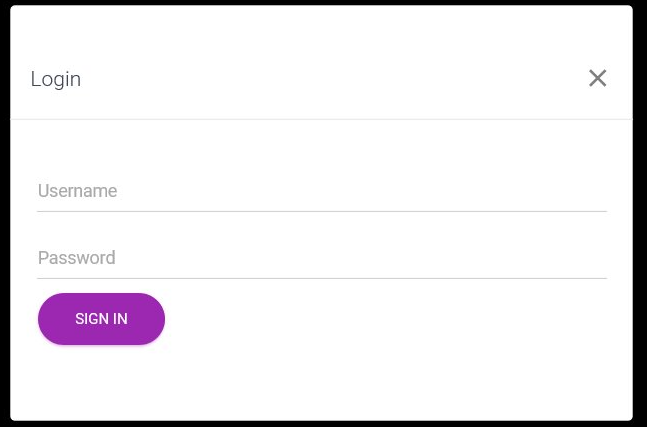
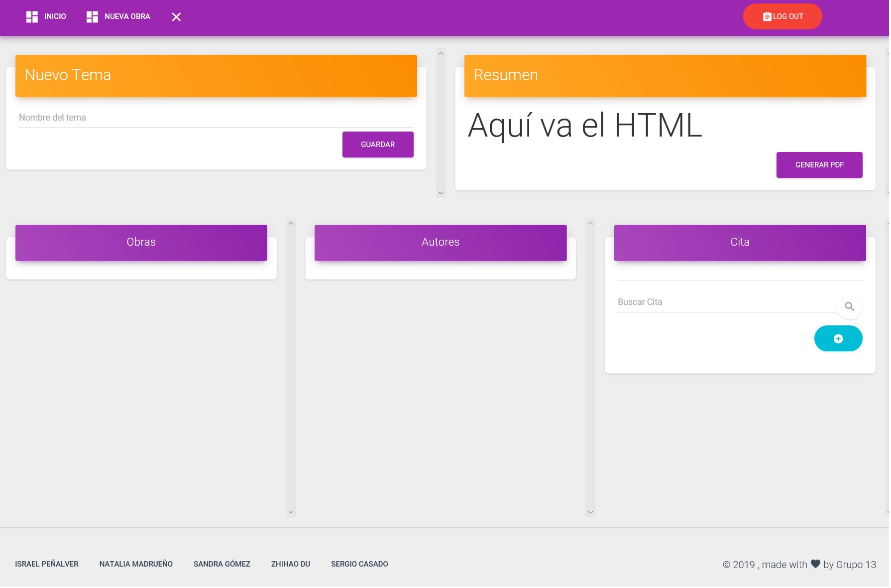

# santatecla-bibliografia-2
  - [Name of the web application](#Name-of-the-web-application)
  - [Members of the development team](#Members-of-the-development-team)
  - [Team coordination](#Team-coordination)
  - [Requirements](#Requirements)
  - [Screenshots](#Screenshots)
  - [Navigation Diagram](#Navigation-Diagram)
  - [Database Entity Diagram](#Database-Entity-Diagram)
  - [Class UML Diagram](#Class-UML-Diagram)
  - [Development Environment](#Development-Environment)
  - [API REST](#API-REST)
  - [ML class with RESTCONTROLLERS](#UML-Class-with-RESTCONTROLLERS)
  - [Docker](#Docker)

Development Environment
Class UML Diagram

## Name of the web application ##
santatecla-bibliografia-2

## [Members of the development team ##
| Name | Mail | GitHub |
| ---- | ---- | ------ |
| Israel Peñalver Sánchez | i.penalver.2016@alumnos.urjc.es | [IsraelSonseca](https://github.com/IsraelSonseca) |
| Natalia Madrueño Sierro |	n.madrueno@alumnos.urjc.es |	[madrueno](https://github.com/madrueno) |
| Sandra Gómez Gálvez |	s.gomezgalv@alumnos.urjc.es |	[sandruskyi](https://github.com/sandruskyi) |
| Zhihao Du Chen |	z.duc@alumnos.urjc.es|	[ZhihaoDC](https://github.com/ZhihaoDC) |
| Sergio Casado López |	s.casadolo@alumnos.urjc.es |	[Segismundo](https://github.com/Segismundo) |

## Team coordination ##
https://trello.com/b/5NANIltP/daw

## Requirements ##
https://drive.google.com/open?id=1CWRq8RUXchpzgKLwoRW4MFCGlrEd05Fe1oJTlBbKZs0

## Screenshots ##

Muestra, con filtros, temas, obras y autores disponible en el sistema. Permite: Login, logout, y crear, abrir y eliminar tanto tema, obra y autor.

Pestaña autor: Muestra todas las citas de sus obras, todas sus obras y todos los temas con alguna de sus citas junto con sus campos (nombre, url foto, fehcas de nacimiento y defunción -optativa- lugar de nacimiento, url mapa) permitiendo:
Modificar campo de autor (click), directamente cambiando el valor de cualquiera de sus campos
Logout, si ya está “loggeado”

Pestaña Obra: Muestra la obra con sus campos (título, url de la imagen de la obra, su foto, fecha de publicación, editorial y url de la imagen de la editorial y su foto) junto con los temas donde está citada dicha obra, sus autores, el resto de autores con filtro de búsqueda y sus citas.

Muestra el tema con el texto, la obra y autor de cada una de sus citas en campos y en formato HTML correspondiente junto con todas sus obras, autores y citas referenciadas con el resto de citas filtradas, permitiendo:
Añadir cita a tema (+), mediante la selección de uno de los autores restantes
Eliminar cita de tema (-), avisando al usuario que se pierden los datos
Generar pdf (botón), abriendo el documento en formato pdf correspondiente
Logout, si ya está “loggeado”

## Navigation Diagram ##
* Guest View

* Users View

* Admin View

## Database Entity Diagram ##

## Class UML Diagram ##

## Development Environment ##

To carry out this work we have used Spring Tool Suite.

This development environment allows 
you to have almost everything you need to develop the web.

You must install:

* MySql

You also need to have the latest version of JDK and MAVEN installed on your machine.

Once you download the code and have all these, go to Spring Tool Suite and open the project.
You must wait for everything to load, it may take a few minutes.

Then, you must create a SQL Database, using MySQL extension, with the following credentials:
- User: root
- Password: root

Once it is loaded, place the cursor on the application.class and click on run.
Once it has been executed, open the browser and enter the following URL: **https//:localhost:8443/**.

Admin account registered:
- User: admin
- Pass: pass

User account registered:
- User: user
- Pass: pass

YOU ARE READY TO USE OUR WEB APPLICATION

## API REST ##
[Documentation](https://github.com/CodeURJC-DAW-2018-19/santatecla-bibliografia-2/blob/master/ApiRestDocumentation.md)

## UML class with RESTCONTROLLERS ##
Green and blue boxes have the same equivalent logic, and can acces to services, where there is the implementation of the logic.

## Docker ##
Now, we will explain what to do to execute our application on Docker.

First of all, we need to install Docker:

* 

The sudo command will depend on your docker configuration.
We will use 2 containers: MySQL and another containing the Web application and the REST API.
If you want to download the images separately you can download them by typing in the shell: 

      <  (sudo) docker pull mysql >
      <  (sudo) docker pull sandruskyi/api  >
        
To run the Dockerizada application with Docker-compose: Go to the folder Santatecla-bibliography -2/Docker type in the shell:          

    < 	(sudo)./create_image.sh  	>

The script will execute a build of the Dockerfile. txt and also  "Docker-Compose up "
	So the application will be running and you can access it through: https://0.0.0.0:8080
- If you want to see your processes running: 
    
    <  (sudo) docker ps >

-  If you want to stop them: 

  < (sudo) docker stop (image ID) > 

- If you want to delete them: 

  < (sudo) docker rm (image ID) >

- To stop or delete all your images: 

  < (sudo) docker stop $( (sudo) docker ps -a -q)>
  < sudo) docker rm $( (sudo) docker ps -a -q)>
 
  
  YOU ARE READY TO USE OUR WEB APPLICATION USING DOCKER

