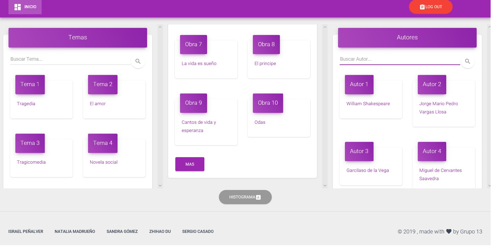
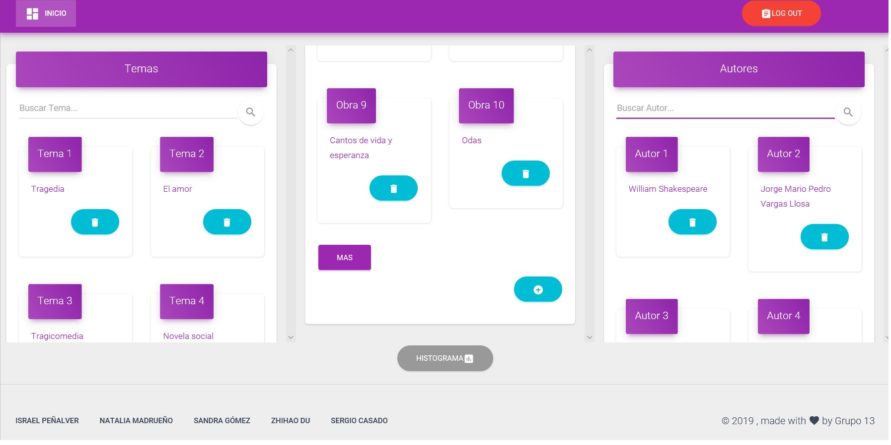
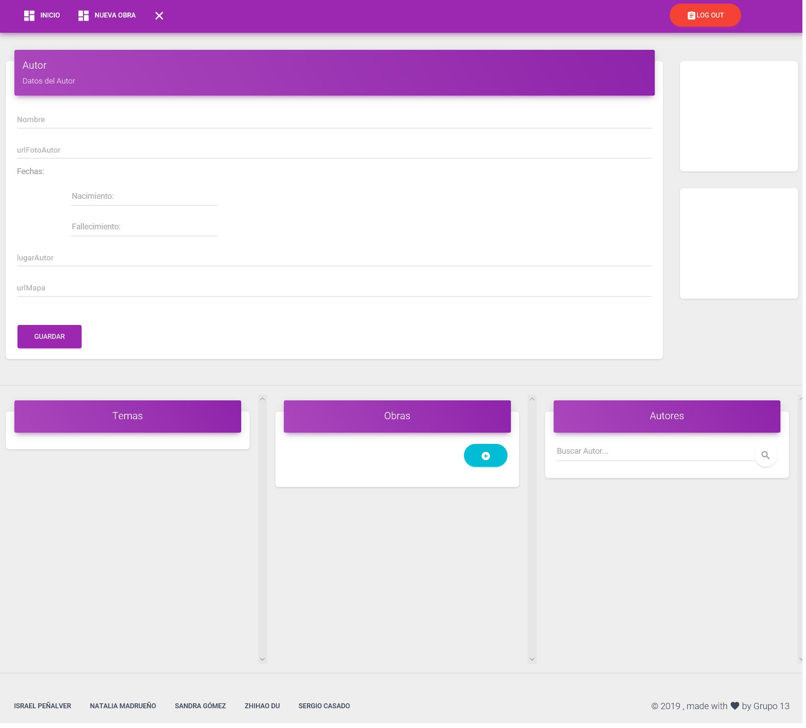
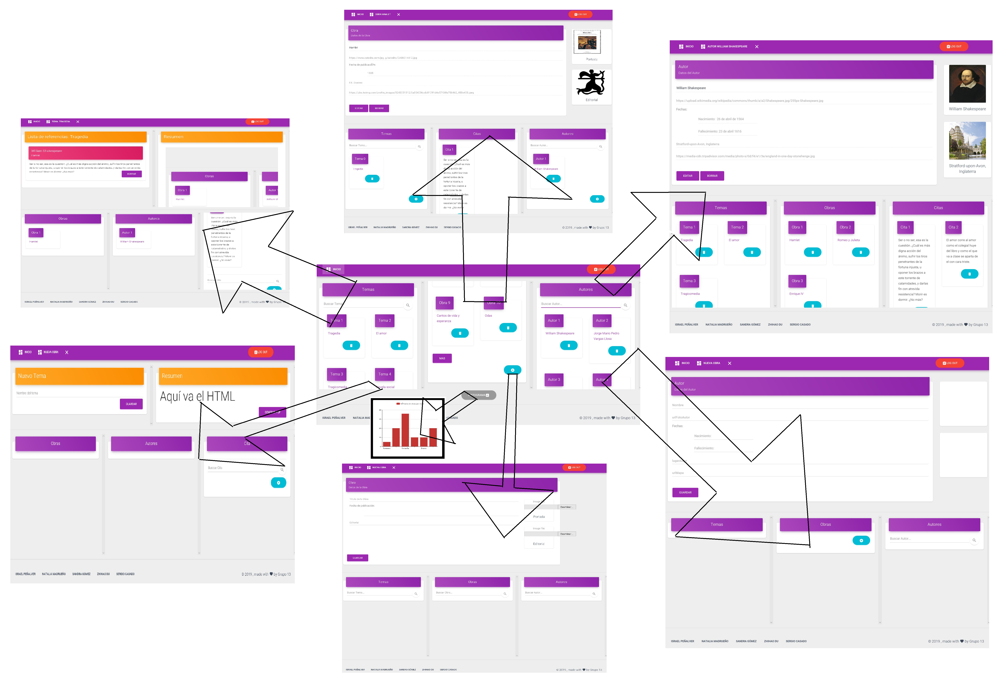

# santatecla-bibliografia-2
  - [Name of the web application](#Name-of-the-web-application)
  - [Members of the development team](#Members-of-the-development-team)
  - [Team coordination](#Team-coordination)
  - [Requirements](#Requirements)
  - [Screenshots](#Screenshots)
  - [Navigation Diagram](#Navigation-Diagram)

## Name of the web application ##
santatecla-bibliografia-2

## [Members of the development team ##
| Name | Mail | GitHub |
| ---- | ---- | ------ |
| Israel Peñalver Sánchez | i.penalver.2016@alumnos.urjc.es | [IsraelSonseca](https://github.com/IsraelSonseca) |
| Natalia Madrueño Sierro |	n.madrueno@alumnos.urjc.es |	[madrueno](https://github.com/madrueno) |
| Sandra Gómez Gálvez |	s.gomezgalv@alumnos.urjc.es |	[sandruskyi](https://github.com/sandruskyi) |
| Zhihao Du Chen |	z.duc@alumnos.urjc.es|	[ZhihaoDC](https://github.com/ZhihaoDC) |
| Sergio Casado López |	s.casadolo@alumnos.urjc.es |	[Segismundo](https://github.com/Segismundo) |

## Team coordination ##
https://trello.com/b/5NANIltP/daw

## Requirements ##
https://drive.google.com/open?id=1CWRq8RUXchpzgKLwoRW4MFCGlrEd05Fe1oJTlBbKZs0

## Screenshots ##

Muestra, con filtros, temas, obras y autores disponible en el sistema. Permite: Login, logout, y crear, abrir y eliminar tanto tema, obra y autor.

Pestaña autor: Muestra todas las citas de sus obras, todas sus obras y todos los temas con alguna de sus citas junto con sus campos (nombre, url foto, fehcas de nacimiento y defunción -optativa- lugar de nacimiento, url mapa) permitiendo:
Modificar campo de autor (click), directamente cambiando el valor de cualquiera de sus campos
Logout, si ya está “loggeado”

Pestaña Obra: Muestra la obra con sus campos (título, url de la imagen de la obra, su foto, fecha de publicación, editorial y url de la imagen de la editorial y su foto) junto con los temas donde está citada dicha obra, sus autores, el resto de autores con filtro de búsqueda y sus citas.

Muestra el tema con el texto, la obra y autor de cada una de sus citas en campos y en formato HTML correspondiente junto con todas sus obras, autores y citas referenciadas con el resto de citas filtradas, permitiendo:
Añadir cita a tema (+), mediante la selección de uno de los autores restantes
Eliminar cita de tema (-), avisando al usuario que se pierden los datos
Generar pdf (botón), abriendo el documento en formato pdf correspondiente
Logout, si ya está “loggeado”

## Navigation Diagram ##
* Guest View

* Users View

faltan las de usuario normal

* Admin View

